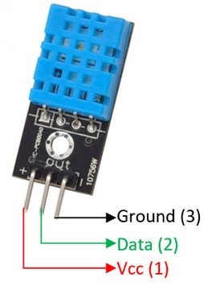

# ArduinoVoiceTempControlled
## CSE2006 J Component Review 02

### Hardware Used

* NodeMCU ESP8266 MicroController
 
* DHT11 Temperature and Humidity Sensor

### Technologies Used
* Sqlite Database
* Using ExpressJS & NodeJS For the Server
* Socket.IO For Implementation of WebSocket Protocol
* Arduino Framework To Interface with the ESP8266 MicroController
* TailwindCSS for the Design of the Website
* Cloudflared Quick Tunnels to provide Connection between the Internet and the Local Server

### Instructions To Run The Project

```
git clone <this-branch> .
```
```
cd <directory-name>
```
```
npm install
```

### To Run the Server Locally
```
npm run start
```

### When Changing the CSS in the HTML Files
```
npm run dev
```

### Run Before Pushing Changes To Minify Tailwindcss
```
npm run build
```

### To Run using Cloudflare Tunnels 
```
npm run serve
```
